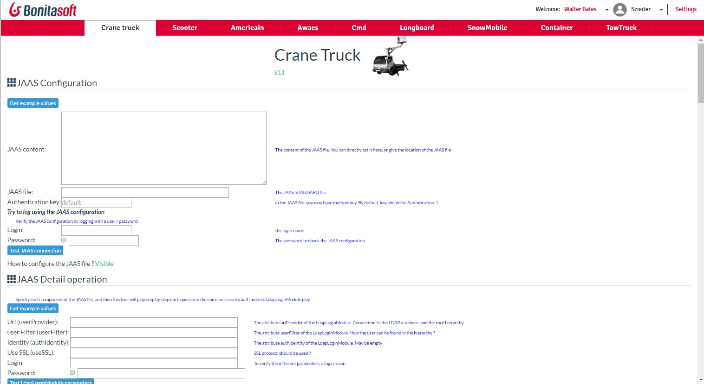

# page_cranetruck
The page help you to configure you JAAS service. Give the parameters, and then test immediately if all is correct.
If you have a subcription version, you have access to the LDAP Synchronizer tool. Copy the JAR file, and then you can verify that the parameters are correct.

